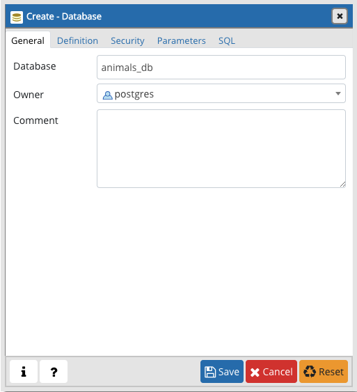
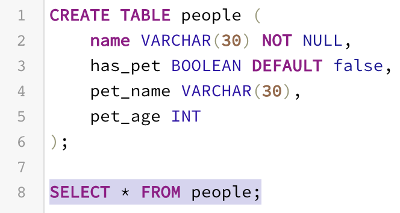
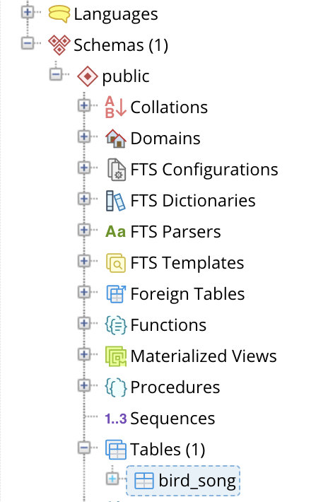
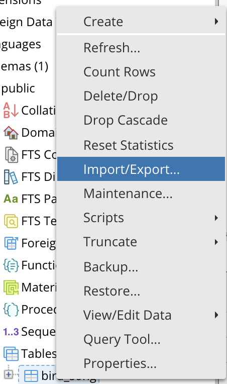
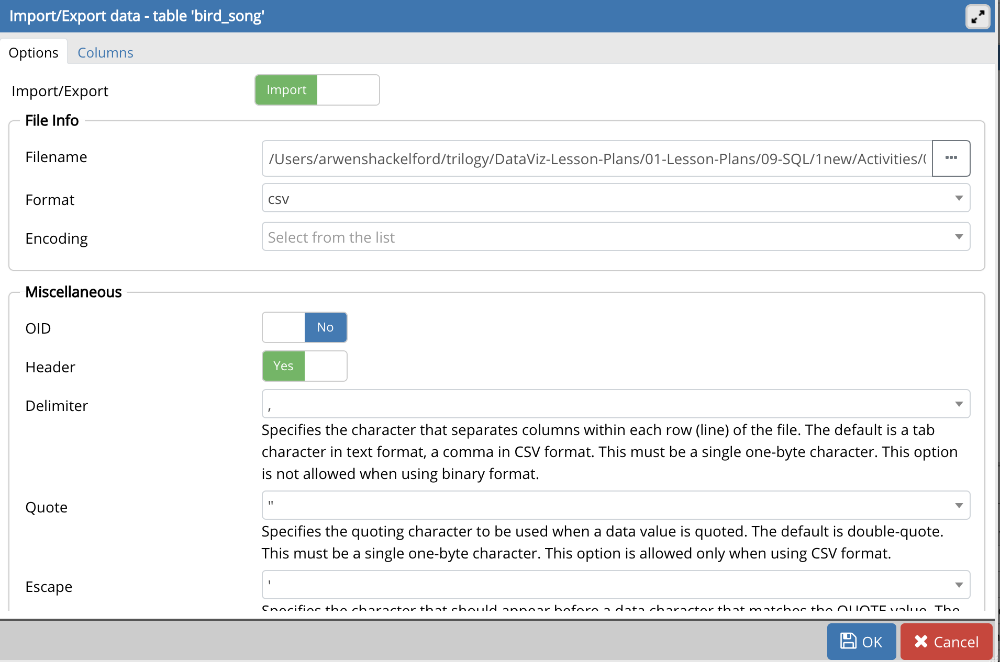
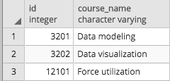
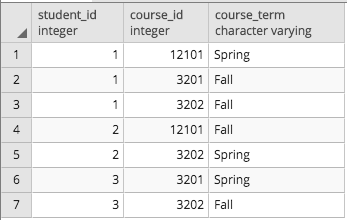
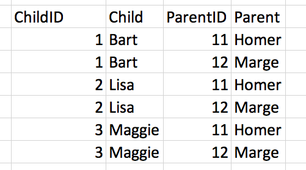
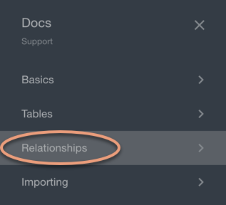

# Module 7: Virtual Class (Required) Lesson Plan

## Overview

Today's Virtual Class (Required) lesson will review SQL database concepts, basic SQL queries, and ERD diagrams. This lesson builds on the weekly materials covered in "Module 7: Employee Database" to cement the topics covered in new contexts.

## Learning Objectives

At the end of the session, learners will be able to:

* Create table relationships with primary and foreign keys
* Explain entity relationships
* Create ERD diagrams
* Create a database
* Create tables
* Import CSV files into SQL
* Perform SQL queries including joins, aggregate functions, and ordering

## Instructor Prep

<details>
  <summary><strong>Career Services</strong></summary>

  Just a reminder that each week students receive a Career Connection in their course of work that ties to what academic content is being consumed. This Career Connection relates this week's material to a professional setting, encourages students to complete certain Career Services tasks, and provides technical interviewing questions, where applicable, that the student can work through.

  Encourage students to work through this material and if you'd like more information on Career Services, please check out the Career Services [resource page](http://bit.ly/DataVizCS) for Data Analytics and Visualization.

</details>

- - -

# Class Activities

## 1. Warm Up & Temperature Check

| Activity Time: 0:10 | Elapsed Time: 0:10 |
|---------------------|--------------------|

<details>
  <summary><strong> 🎉 Everyone Do: Interview Question Warm-Up (5 mins before class, first 5 mins of class)</strong></summary>

Open the [slideshow](https://docs.google.com/presentation/d/14hDLwKB0X82NAi1bFzALxMxqP4E040ucMIE_thoZXcE/edit?usp=sharing) for today's class and begin the weekly presentation with the first slide. The first slide displays an interview question that a student may encounter based on the content of this week's content.

**This week's question:** What advantages do databases have over Pandas?

Allow the question to be on the screen 5 mins prior to the start of class as students join the session. Allow the class 1 minute at the start of class to review, then you will ask for a student to volunteer their answer to the question. Next, offer the answer or a few approaches you would take for answering the question.

**Possible answers to this week's question:**

* Databases store data long term, while Pandas DataFrames are stored in volatile memory

* Databases make it easier to share data

* Databases have built-in protections against data corruption

* Databases can hold much larger datasets

</details>

<details>
  <summary><strong> 📣 Instructor Do: Temperature Check (5 mins)</strong></summary>

Using the [Zoom Polling](https://support.zoom.us/hc/en-us/articles/213756303-Polling-for-Meetings) feature or a [Poll Everywhere](http://www.polleverywhere.com), launch a poll of the class to identify areas that they would like to review from the week's asynchronous content.

**Poll Text:**

*Select all of the topics that you feel prepared to apply outside of the class from this week's lesson:*

* *Creating a database*
* *Making and Using IDs*
* *Creating and importing data into tables*
* *Queries*
* *Joins*
* *COUNT and GROUP BY*
* *ORDER BY*
* *Primary keys and foreign keys*
* *Data Relationships*

Based on the results of the poll, advance to the correct slide for a review of the topics with the lowest scores. Choose 2 topics at minimum to review, or more as time permits to review.

</details>

## 2. Adaptive Learning Blocks

| Activity Time:  1:00 |  Elapsed Time: 1:10  |
|----------------------|----------------------|

>***Choose:***
>
>* Two 30-min blocks
>
>***then proceed to 3. Entity Relationship Diagrams***

### Creating a Database (30 mins)

<details>
  <summary><strong> 🎉 Everyone Do: Create a Database (10 mins)</strong></summary>

* Begin by verifying that everyone has successfully installed pgAdmin and Postgres. Everyone should have completed this step prior to today's session.

  * Open pgAdmin in a new browser window and ensure that everyone is able to follow along and view their new server in the browser.

    

* Walk the class through the steps to create a database using pgAdmin.

  * In the pgAdmin editor, right-click the newly established server to create a new database.

  * From the menu, select **Create**, and then select **Database** to create a new database.

  

  * Enter **animals_db** as the database name. Make sure the owner is set as the default postgres, and then click **Save**.

  

* At this point, show students that there is a new database listed in the left-hand menu. Explain that the new database, `animals_db`, is not yet connected to the server. Simply clicking on the database will create a connection to Postgres.

  

* Answer any questions before moving on.

</details>

<details>
  <summary><strong> ✏️ Student Do: Creating Tables (15 mins)</strong></summary>

* In this activity, students will use pgAdmin to recreate and query a table from an image provided.

**Instructions:** [README.md](Activities/A1-Stu_Creating_Tables/README.md)

</details>

<details>
  <summary><strong> ⭐ Review: Creating Tables (5 mins)</strong></summary>

* **File:** [query.sql](Activities/A1-Stu_Creating_Tables/Solved/query.sql)

* Create a new database named `city_info` in pgAdmin. Then use the query tool to copy and paste, or live code, the solution from `query.sql`.

  * To create a new table, remind students to specify the data type for each column.

    ```sql
    CREATE TABLE cities (
      city VARCHAR(30) NOT NULL,
      state VARCHAR(30) NOT NULL,
      population INT
    );
    ```

* Insert multiple rows of data into the new table.

  * Point out to students that each column is specified in the `INSERT INTO` clause, and the values are inserted in the same order.

  * To make the code easier to read, each row of values is on its own line, separated by a comma.

    ```sql
    INSERT INTO cities (city, state, population)
    VALUES ('Alameda', 'California', 79177),
      ('Mesa', 'Arizona', 496401),
      ('Boerne', 'Texas', 16056),
      ('Anaheim', 'California', 352497),
      ('Tucson', 'Arizona', 535677),
      ('Garland', 'Texas', 238002);
    ```

* Create a query to view the data using the `SELECT` clause.

  ```sql
  SELECT *
  FROM cities;
  ```

  * Point out the syntax here. Even though the code can fit on a single line, it's good practice to split it up over two lines instead. This way, the code is easier to read when more advanced queries are created.

* Using the `SELECT` clause again, query the data to return only the cities in the table.

  ```sql
  SELECT city
  FROM cities;
  ```

* Explain to students that the first bonus question incorporates a `WHERE` clause, which further filters the data.

  * The `WHERE` clause is used to search for specific data within a database. In this case, we are extracting only the records that meet the specified condition.

  * In the line `WHERE state = 'Arizona';` we are specifying Arizona in the state column.

    ```sql
    SELECT city, state
    FROM cities
    WHERE state = 'Arizona';
    ```

* Demonstrate the solution to the second bonus question.

  * Point out to students that the `WHERE` clause is highly customizable, such as with the use of the `<` operator.

    ```sql
    SELECT *
    FROM cities
    WHERE population < 100000;
    ```

* Walk through the solution to the third and final bonus question.

  * Explain to students that queries can be filtered even further with the `AND` clause. This clause allows users to specify more than one condition in their query.

    ```sql
    SELECT *
    FROM cities
    WHERE population < 100000
    AND state = 'California';
    ```

* Answer any questions before moving on.

</details>

<sub>[Having issues with this section? Report a bug!](https://bit.ly/35NweWG)</sub>

### Making and Using IDs (30 mins)

<details>
  <summary><strong> 📣 Instructor Do: Create a Table (10 mins)</strong></summary>

* Now that there is a database on the server, it's time to dig into the real meat of SQL and start creating tables within the new database!

* From the left-hand menu in pgAdmin, right-click **animals_db** and select **Query Tool**.

  **Note:** You can also select **Query Tool** from the Tools drop-down menu at the top of the screen. (See second screenshot below.)

  

  

* Explain to students that this is how to access the code editor.

* Type the following lines of code, explaining each line:

  ```sql
  CREATE TABLE people (
    name VARCHAR(30) NOT NULL,
    has_pet BOOLEAN DEFAULT false,
    pet_type VARCHAR(10) NOT NULL,
    pet_name VARCHAR(30),
    pet_age INT
  );
  ```

  * `CREATE TABLE people (<COLUMNS>);` creates a table called `people` with the columns listed within the parentheses.

  * `name VARCHAR(30) NOT NULL` creates a  `name` column, which can hold character strings of up to 30 characters and will not allow null fields.

  * The `NOT NULL` constraint requires the name field to have a value specified.

  * `pet_type VARCHAR(10) NOT NULL,` creates a `pet_type` in the same manner as the `name` column is created. The only difference is the number of characters allowed in the column.

  * `has_pet BOOLEAN DEFAULT false` creates a `has_pet` column that holds either true or false values, though the default value is now set as false.

  * `pet_name VARCHAR(30)` creates a `pet_name` column, which can hold character strings of up to 30 characters and will allow null fields.

  * `pet_age INT` creates a`pet_age` column, which can hold whole numbers.

  * **Note:** Be sure to point out the semicolon at the end of the statement, which tells pgAdmin that this line of code has concluded.

* After reviewing the code, click the lightning bolt icon to run the script. Make a note of the Messages tab at the bottom of the screen.

  

* Demonstrate that the structure of a table can be visualized using `SELECT * FROM <table name>;`.  Point out the error message that now appears at the bottom of the page.

  * Explain that SQL data is persistent; it is not deleted or overwritten when identical commands are run unless specifically commanded. This means that when a database or table is created with a  name identical to one that already exists, an error will occur telling the user that the database or table already exists.

  * Ask the class how to avoid this kind of error. Students may respond that they can simply delete the offending line of code and then run the commands again. Explain that while this method would work, deleting working code is not a best practice.

  * Show the class an alternative method: Highlight the lines of code to run, and then click the lightning bolt icon to run only the highlighted selection. This method of running SQL code is preferable to deleting previous code.

    

* Point out that the structure of a table can be visualized using `SELECT * FROM <table name>;`.

  * Explain that using the asterisk in this manner tells pgAdmin to select all fields from the table.

  * In the future, students will be able to view the structure of their table, and all of the values contained within it, using this same line of code.

* Type the following code while explaining what it does line by line.

  ```sql
  INSERT INTO people (name, has_pet, pet_type, pet_name, pet_age)
  VALUES ('Jacob', true, 'dog', 'Misty', 10),
    ('Ahmed', true, 'rock', 'Rockington', 100),
    ('Peter', true, 'cat', 'Franklin', 2),
    ('Dave', true, 'dog', 'Queso', 1);

  SELECT *
  FROM people;
  ```

  * This code operates as it reads: it inserts data into the `people` table and then specifies the columns in which data will be entered.

  * The `VALUES` line places the data contained in the parentheses into the corresponding columns listed after the `INSERT INTO` statement.

  * Note: Single quotations must be used for insert strings; otherwise, an error will result.

* Use the following code to query the table, extracting only the `pet_name`.

  ```sql
  SELECT pet_name
  FROM people;
  ```

  * Explain that specifying a column name in the `SELECT` statement will return only the data contained in that field.

* Filter the queried data to display only dogs younger than 5.

  ```sql
  SELECT pet_type, pet_name
  FROM people
  WHERE pet_type = 'dog'
  AND pet_age < 5;
  ```

* Explain the following points:

  * The `SELECT` clause can specify more than one column.

  * Data is filtered by using additional clauses such as `WHERE` and `AND`.

  * The `WHERE` clause will extract only the data that meets the condition specified. `AND` adds a second condition to the original clause, further refining the query.

</details>

<details>
  <summary><strong> ✏️ Student Do: Making and Using an ID (10 mins)</strong></summary>

In this activity, students will recreate a table and then query, insert, and update data.

**Instructions:** [README.md](Activities/A3-Stu_Making_IDs/README.md)

</details>

<details>
  <summary><strong> ⭐ Review: Making and Using an ID (5 mins)</strong></summary>

* **File:** [query.sql](Activities/A3-Stu_Making_IDs/Solved/query.sql)

* Open query.sql and copy the code into pgAdmin.

* Go over the lines of code used to create the ID and set it as the primary key. Make sure the class understands how this works, and explain how useful this will be in this week's homework.

* Review how to create a new column using the `ALTER TABLE` and `ADD COLUMN` statements. Explain that adding the column name and data type is completed in the same manner as creating a new table.

* Answer any questions before moving on.

</details>

<details>
  <summary><strong> 📣 Instructor Do: The Value of Unique Values (5 mins)</strong></summary>

* **File:** [query.sql](Activities/A4-Ins_Values_of_Uniques/Solved/query.sql)

* Using the `people` table from the `animals_db` database, insert the duplicate data below into the table and then visualize the table with the new information.

  ```sql
  INSERT INTO people (name, has_pet, pet_type, pet_name, pet_age)
  VALUES ('Ahmed', true, 'rock', 'Rockington', 100);

  SELECT *
  FROM people;
  ```

  * Duplicate data is a real-world occurrence (and an eyesore). Demonstrate how to remove the rows containing the string `Ahmed` in the `name` column.

    ```sql
    DELETE FROM people
    WHERE name = 'Ahmed';
    ```

  * The duplicate was deleted, but so was the original row. That's a little annoying. Make sure the class understands why this happened.

  * Because the name Ahmed appears twice in the table, SQL assumes that the user wants to delete every column containing that name; it doesn't understand that the user is simply trying to remove the duplicate row.

  * To prevent this kind of thing from occurring, programmers will often want to create a column that automatically populates each new row with unique data. This allows them to select and modify that row more easily.

* Remove the `people` table by running the following line of code:

  ```sql
  -- Delete the table "people"
  DROP TABLE people;
  ```

* Copy the following code from the `query.sql` file and paste it in the pgAdmin editor.

  ```sql
  -- Re-create the table "people" within animals_db
  CREATE TABLE people (
    id SERIAL PRIMARY KEY,
    name VARCHAR(30) NOT NULL,
    has_pet BOOLEAN DEFAULT false,
    pet_type VARCHAR(10) NOT NULL,
    pet_name VARCHAR(30),
    pet_age INT
  );

  -- Insert data into the table
  INSERT INTO people (name, has_pet, pet_type, pet_name, pet_age)
  VALUES ('Jacob', true, 'dog', 'Misty', 10),
    ('Ahmed', true, 'rock', 'Rockington', 100),
    ('Ahmed', true, 'rock', 'Rockington', 100),
    ('Peter', true, 'cat', 'Franklin', 2),
    ('Dave', true, 'dog', 'Queso', 1),
    ('Dave', true, 'dog', 'Pringles', 7);

  -- Query all fields from the table
  SELECT *
  FROM people;
  ```

  * Explain that a *primary key* uniquely identifies a row.

  * `SERIAL` generates a new value for each inserted record in the table. By default, the starting value is 1, and it will increase by 1 for each new record. When using `SERIAL` with our unique `PRIMARY KEY`, we automatically get unique, incrementing values for each table row.

  * Point out that because values will automatically increment, each row's ID is guaranteed to be unique. This ensures that SQL does not identify and update the wrong row when CRUD—Create, Read, Update, Delete—statements are implemented.

  * Point out that the `INSERT` statements have not changed, as they do not need to insert data specifically into the `id` column. SQL automatically provides a value for this column, fulfilling the uniqueness constraint by automatically incrementing the last value used as an ID.

  * The data type for the `id` column is automatically assigned as an integer.

* One entry in the table is incorrect: one of the Daves has the wrong `pet_name` and `pet_age`. We need to update the `pet_name` from Pringles to Rocket and the `pet_age` from 7 to 8.

  * To avoid issues with updating multiple rows, it's best to update by ID. First, query by name to find the ID for the row we want to update.

    ```sql
    SELECT id, name, pet_name, pet_age
    FROM people
    WHERE name = 'Dave';
    ```

  * This will return all rows that contain the name Dave, including the `id`, `pet_name`, and `pet_age` columns.

  * Next, we can select and update the `pet_name` from Pringles to Rocket and the `pet_age` from 7 to 8 based on the row's unique ID.

    ```sql
    UPDATE people
    SET has_pet = true, pet_name = 'Rocket', pet_age = 8
    WHERE id = 6;
    ```

  * Note that, similar to a query, the `WHERE` statement is used to pinpoint the data we want to change. In this case, the `id` column is used to select the unique row we want to affect.

  * Duplicate data is also easier to remove with the use of a unique ID. With the following code, remove the duplicate data.

    ```sql
    DELETE FROM people
    WHERE id = 3;
    ```

  * This does precisely what was desired: duplicate data is deleted, and original data is preserved.

* Answer any remaining questions before moving on.

</details>

<sub>[Having issues with this section? Report a bug!](https://bit.ly/3blVMeW)</sub>

### Creating and Importing Data Into Tables (30 mins)

<details>
  <summary><strong> ✏️ Student Do: Hide and Seek (15 mins)</strong></summary>

In this activity, students will create a new table and import data from a CSV file.

* **Files:**

  * [WordAssociation_AC.csv](Activities/A5-Stu_Hide_and_Seek/Resources/WordAssociation_AC.csv)

  * [WordAssociation_BC.csv](Activities/A5-Stu_Hide_and_Seek/Resources/WordAssociation_BC.csv)

* **Instructions:** [README.md](Activities/A5-Stu_Hide_and_Seek/README.md)

</details>

<details>
  <summary><strong> ⭐ Review: Hide and Seek (5 mins)</strong></summary>

* **File:** [query.sql](Activities/A5-Stu_Hide_and_Seek/Solved/query.sql)

* Open pgAdmin and paste the code from `query.sql` into the editor. Explain the following:

  * Although the CSV data does not contain an `id` column, when we specify `SERIAL PRIMARY KEY` while creating the table, IDs will automatically be assigned to each row.

  * To view a range of data, we can use a combination of `WHERE` and `AND` statements.

  * To collect data that exists in either one column or another, the `OR` statement is included in the query.

* Walk through the solutions to the bonus questions, touching on the following points:

  * After importing the second table, we can specify a source with the `WHERE` statement.

  * `AND` statements can be used more than once for more specific results.

* Answer any questions before moving on.

</details>

<details>
  <summary><strong> 📣 Instructor Do: Import Data (10 mins)</strong></summary>

* **Files:**

  * [birdsong.csv](Activities/A6-Ins_Importing_Data/Resources/birdsong.csv)

  * [query.sql](Activities/A6-Ins_Importing_Data/Solved/query.sql)

* So far, the class has created their own tables and values manually using SQL code. As one might imagine, this process can be tedious when translating large datasets from external sources. Thankfully, pgAdmin includes a built-in import tool that can take CSV files and easily import their data into tables.

* Return to pgAdmin and create a new database called `Miscellaneous_DB`.

* Open the CSV file within an integrated development environment, such as Excel, to show the dataset that will be imported. Be sure to point out that the first row of this dataset includes headers.

  * Open a query tool within `Miscellaneous_DB` and create a table named `bird_song`. Point out that the columns created match the data in the CSV file.

  * Once the table has been created, right-click **Miscellaneous_DB** from the left-hand menu and select **Refresh**.

  * Scroll down to Schemas and expand that menu, and then expand the Tables menu.

    

  * Right-click the new table and select **Import/Export** from the menu.

    

* In the Options tab, complete the following steps:

  * Slide the Import/Export tab to **Import**.

  * Click on the dot menu to navigate to the `birdsong.csv` file on your computer.

  * Slide the Header tab to **Yes**.

  * Select the comma from the drop-down menu to set it as the Delimiter.

  * Leave the other fields as they are, and then click **OK**.

  

* In the query tool, rerun `SELECT * FROM birdsong` to verify that data has been imported.

* Let the class know that the bigger a dataset is, the longer it will take for pgAdmin to import values.

</details>

<sub>[Having issues with this section? Report a bug!](https://bit.ly/2Aj7tGk)</sub>

### Queries (30 mins)

<details>
  <summary><strong> ✏️ Student Do: Using CRUD (20 mins)</strong></summary>

* In this activity, students will utilize CRUD operations (Create, Read, Update, Destroy) on the provided data.

* **Files:**
  * [schema.sql](Activities/A7-Stu_CRUD/Resources/schema.sql)

  * [GlobalFirePower.csv](Activities/A7-Stu_CRUD/Resources/GlobalFirePower.csv)

* **Instructions:** [README.md](Activities/A7-Stu_CRUD/README.md)

* Let the class know that they will be using the `WHERE` clause in this activity.

* This activity will require students to do some research. Links are provided to help them search for solutions to problems they are likely to encounter.

</details>

<details>
  <summary><strong> ⭐ Review: Using CRUD (5 mins)</strong></summary>

* **Files:**

  * [schema.sql](Activities/A7-Stu_CRUD/Resources/schema.sql)

  * [query.sql](Activities/A7-Stu_CRUD/Solved/query.sql)

  * [GlobalFirePower.csv](Activities/A7-Stu_CRUD/Resources/GlobalFirePower.csv)

* Open a query tool in `MiscellaneousDB` and copy and paste the code from schema.sql to create a new table named `firepower`. Go over the following:

  * Refresh the table list, and then import the data from `GlobalFirePower.csv` into the new table.

  * First, alter the table to add an `id`.

  * Deletions and updates are made where the conditions are met.

  * Multiple averages can be selected at once.

  * Values can be inserted into the table even though not every value is filled out.

  * Finally, select all values to show the newly added country.

</details>

<details>
  <summary><strong> 📣 Instructor Do: CRUD (5 mins)</strong></summary>

* Inform students that "CRUD", while an unusual acronym, is a set of tools that are persistently used throughout programming. CRUD stands for Create, Read, Update, and Delete.

* Engage the class in a discussion by asking them to provide examples of CRUD operations.

* In today's class, each of the operations has been in use. Students have:

  * Created data in a table with the `INSERT` statement.

  * Read data with the use of `SELECT`.

  * Updated a table's data using `UPDATE`.

  * Deleted data using `DELETE`.

* Introduce the class to an additional method of reading the data: wildcards.

  * A wildcard is a character—either a percentage sign or an underscore—that takes the place of one or more characters in a query.

  * The keyword `LIKE` indicates the use of a wildcard in a query.

  * The percentage sign (%) signifies that zero, one, or multiple characters will be substituted in a query.

    * For example, in the query `WHERE last_name LIKE 'Will%';` all names in the database beginning with "Will" will be returned, no matter the length.

  * When using the underscore as a wildcard, only a single character is replaced in the query.

  * In the line `WHERE first_name LIKE '_AN';`, only three-lettered names ending with "an" will be returned.

* Answer any questions before moving on.

</details>

<sub>[Having issues with this section? Report a bug!](https://bit.ly/2LkY1oc)</sub>

### Joins (30 mins)

<details>
  <summary><strong> ✏️ Student Do: Joining the NBA (15 mins)</strong></summary>

* In this activity, students will be using joins to query NBA player seasonal statistics.

* **Files:**

  * [Players.csv](Activities/B1-Stu_Joins/Resources/Players.csv)

  * [Seasons_Stats.csv](Activities/B1-Stu_Joins/Resources/Seasons_Stats.csv)

  * [schema.sql](Activities/B1-Stu_Joins/Resources/schema.sql)

* **Instructions:** * [README.md](Activities/B1-Stu_Joins/README.md)

</details>

<details>
  <summary><strong> ⭐ Review Joining the NBA (5 mins)</strong></summary>

* **File:** [query.sql](Activities/B1-Stu_Joins/Solved/query.sql)

* Using the schema.sql file and the query tool, create two new tables named `players` and `seasons_stats` using the data in `Players.csv` and `Seasons_Stats.csv`.

* Open `query.sql` and copy the code. Then open a new query tool and paste the solution into the editor. Review the solution, explaining the following:

  * Since the selected data comes from two different tables, the naming convention is `table_name.column_name`.

  * Next, determine which table to select from and which table to `INNER JOIN` with. Remember, the inner join only selects data that has matching values in both tables.

  * Finally, determine the key both tables will join on. For example, to join the two tables by using the `id` and an `INNER JOIN`, select the data columns to be viewed from both tables, and then specify which columns the tables will be connected by.

    ```sql
    SELECT players.id,
      players.player,
      players.height,
      players.weight,
      players.college,
      players.born,
      seasons_stats.position,
      seasons_stats.tm
    FROM players
    INNER JOIN seasons_stats ON
    players.id = seasons_stats.player_id;
    ```

* Answer any questions before ending class.

</details>

<details>
  <summary><strong> 📣 Instructor Do: Joins (10 mins)</strong></summary>

* **Files:**

  * [query.sql](Activities/B2-Ins_Joins/Solved/query.sql)

  * [players.csv](Activities/B2-Ins_Joins/Resources/players.csv)

  * [matches.csv](Activities/B2-Ins_Joins/Resources/matches.csv)

* Students may recall working with merges and joins to combine datasets during the Pandas module. While SQL is a vastly different language than Python, it also includes the functionality to merge tables.

* Create two new tables in `MiscellaneousDB` in pgAdmin named `players` and `matches`.

  * Copy the code from `query.sql` to create the tables, and then import the corresponding data from `players.csv` and `matches.csv`.

  * Remember to refresh the database; newly created tables will not immediately appear.

  * Point out that both tables have matching values within the `player_id` column of the `players` table and the `loser_id`/`winner_id` columns of the `matches` table.

  * Because there are common values, it is possible to join these tables together. For example:

    ```sql
    INNER JOIN players ON
    players.player_id=matches.loser_id;
    ```

  * From the `query.sql` file, copy and paste the code performing an `inner join` on the two tables:

    ```sql
    SELECT players.first_name, players.last_name, players.hand, matches.loser_rank
    FROM matches
    INNER JOIN players ON
    players.player_id=matches.loser_id;
    ```

  * Note: Some students may have advanced knowledge of SQL queries and use aliases in their solutions. Using aliases is not necessary for today's activities; they will be covered more comprehensively in the next class.

    ```sql
    -- Advanced INNER JOIN solution
    SELECT p.first_name, p.last_name, p.hand, m.loser_rank
    FROM matches AS m
    INNER JOIN players AS p ON
    p.player_id=m.loser_id;
    ```

  * Point out one significant difference between SQL joins and Python joins: in SQL joins, the columns that should be viewed after the join must be declared in the initial `SELECT` statement.

    

* There are five primary types of joins that can be used with PostgreSQL:

  * `INNER JOIN` returns records that have matching values in both tables.

  * `LEFT JOIN` returns all records from the left table and the matched records from the right table.

  * `RIGHT JOIN` returns all records from the right table and the matched records from the left table.

  * `CROSS JOIN` returns records that match every row of the left table with every row of the right table. This type of join has the potential to make very large tables.

  * `FULL OUTER JOIN` places null values within the columns that do not match between the two tables, after an inner join is performed.

* Slack out the link to this explanation of Postgres [joins](https://www.tutorialspoint.com/postgresql/postgresql_using_joins.htm) for students to study.

* Demonstrate a couple of different joins that can be performed. Then answer any questions before moving on to the next activity.

</details>

<sub>[Having issues with this section? Report a bug!](https://bit.ly/3btqYcg)</sub>

### COUNT and GROUP BY (30 mins)

<details>
  <summary><strong> ✏️ Student Do: Gregarious Aggregates (15 mins)</strong></summary>

In this activity, students will practice writing queries with aggregate functions, with grouping, and with using aliases. They will be loading and using an example database for the next few activities.

Walk through the following steps with the class to get the database installed.

* Compress the Resources folder and share it with the class. This folder contains everything students need in order to upload the data.

* Together, walk through the following steps to help students install the Pagila database.

  * From pgAdmin, create a database named `rental_db`.

  * Open the Query Tool for the newly created `rental_db`.

  * Copy the code in [pagila-schema.sql](Resources/pagila-schema.sql) into a pgAdmin query window and execute it.

  * Copy the code in [pagila-insert-data.sql](Resources/pagila-insert-data.sql) into a pgAdmin query window and execute it. **Note:** this will take a few minutes due to the amount of data. As long as no errors pop up the data will be uploaded.

Once complete, share the following with the class.

* **File:** [query.sql](Activities/B3-Stu_GregariousAggregates/Unsolved/query.sql)
* **Instructions:** [README.md](Activities/B3-Stu_GregariousAggregates/README.md)

</details>

<details>
  <summary><strong> ⭐ Review: Gregarious Aggregates (5 mins)</strong></summary>

* **File**: [query.sql](Activities/B3-Stu_GregariousAggregates/Solved/query.sql)

* Review the solution in pgAdmin and explain the following:

  * Postgres uses double quotes for table and column names, and single quotes for string constants.

  * `GROUP BY` is similar to the `groupby` operation in Pandas.

  * `SELECT` without aggregates can only choose the columns in the `GROUP BY` clause.

* Answer any questions before moving on.

</details>

<details>
  <summary><strong> 📣 Instructor Do: Aggregate Functions, Aliases, and Grouping (10 mins)</strong></summary>

* Review the following:

  * Similar to aggregates in Pandas, aggregate functions allow calculations on a set of values and return a singular value.

  * Some of most commonly used aggregates are `Avg`, `COUNT`, `MIN`, `MAX`, and `SUM`.

  * Aggregates are often combined with `GROUP BY`, `HAVING`, and `SELECT`.

* **File:** [query.sql](Activities/B4-Ins_Aggregates/Solved/query.sql)

* Select the `rental_db` database in pgAdmin and open a Query window.

* Run `SELECT * FROM film;` and count the number of rows.

* Run `SELECT COUNT(film_id) FROM film;` and explain the following:

  * Using `COUNT()` is an easier way to count the rows.

  * The `COUNT()` function is an aggregate.

  

* Now that the number of `film_id` entries has been counted, it's easy to see a total of 1,000 films.

* Point out that the name of the field returned is `count bigint`, which doesn't describe the column accurately. Postgres has a way to change the column names and make them more descriptive.

* Run the following:

  ```sql
  SELECT COUNT(film_id) AS "Total films"
  FROM film;
  ```

* Explain the following:

  * `AS 'Total films'` is a technique called *aliasing*.

  * Aliasing creates an `alias`, or a new name for the column.

  * Using an alias does not change the table or the database in any way. Aliasing is only a measure of convenience, used to view a column or to create shortcuts for columns or other data.

  

* The `COUNT()` function is great to see the number of movies, but it isn't informative enough when searching for the number of specific ratings, like G or PG-13. This is where `GROUP BY` comes into play.

* Run the following code:

  ```sql
  SELECT rating, COUNT(film_id) AS "Total films"
  FROM film
  GROUP BY rating;
  ```

* Explain the following:

  * The `GROUP BY` method will first group by the column indicated.

  * Aggregates are used to get the values for any columns not included in the `GROUP BY` clause.

  * Here, the `COUNT()` function will count the `film_id` for each `rating`.

  

* Explain that we can aggregate data in other ways besides counting. For example, *sum*, *average*, *min*, and *max* are all valid aggregate functions to apply to the data.

* Ask the class how to query the average rental period for *all* movies. To demonstrate, run the following query:

  ```sql
  SELECT AVG(rental_duration)
  FROM film;
  ```

* To demonstrate how to add an alias to the `AVG()` function, run the following:

  ```sql
  SELECT AVG(rental_duration) AS "Average rental period"
  FROM film;
  ```

* Put it all together by running the following query, showing how to `GROUP BY` rental duration, get the average `rental_rate`, and give it an alias.

  ```sql
  SELECT  rental_duration, AVG(rental_rate) AS "Average rental rate"
  FROM film
  GROUP BY rental_duration;
  ```

  

* Ask a student to explain the query.

  * Movies that can be rented for three days cost an average of $2.82 to rent, movies that can be rented for four days cost an average of $2.97 to rent, and so on.

* SQL can also return the rows that contain the minimum values and maximum values in a column using `MIN()` and `MAX()` respectively.

```sql
  -- Find the rows with the minimum rental rate
  SELECT  rental_duration, MIN(rental_rate) AS "Min rental rate"
  FROM film
  GROUP BY rental_duration;

  -- Find the rows with the maximum rental rate
  SELECT  rental_duration, MAX(rental_rate) AS "Max rental rate"
  FROM film
  GROUP BY rental_duration;
```

* Mention that these aggregate functions calculate and retrieve data, but they do not *alter* the data. That is, they do not modify the database.

* Explain that there are many other aggregate functions students can research. Slack out [Postgres functions](https://www.tutorialspoint.com/postgresql/postgresql_useful_functions.htm) to the class for future reference.

</details>

<sub>[Having issues with this section? Report a bug!](https://bit.ly/3cn0jPB)</sub>

### ORDER BY (30 mins)

<details>
  <summary><strong> ✏️ Student Do: Movies Ordered By (15 mins)</strong></summary>

* In this activity, you will use `ORDER BY` in combination with other SQL methods to query and order the tables.

**Instructions:** [README.md](Activities/B5-Stu_Order_By/README.md)

</details>

<details>
  <summary><strong> ⭐ Review: Movies Ordered By (5 mins)</strong></summary>

* **File:** [query.sql](Activities/B5-Stu_Order_By/Solved/query.sql)

* Open pgAdmin and walk through the solution, highlighting the following:

  * The `actor` table is grouped by `first_name`, with an aggregate taking the count, and then given an alias of `actor count`. The query is then ordered in descending order by the count.

  * The `ROUND` function is used to limit the results to two decimal places.

  * `LIMIT 10` is added to the end of the query to return the top 10 results.

  * For the bonus, a `JOIN` is needed to combine the `country` and `city` tables. The return of the join can then be grouped and aggregated. The result is sorted by the count of countries in descending order.

</details>

<details>
  <summary><strong> 📣 Instructor Do: Order By Aggregates (10 mins)</strong></summary>

* **File:** [query.sql](Activities/B6-Ins_Order_By/Solved/query.sql)

* Explain that aggregate functions return the results in a random order. This can be tough when trying to find the top or bottom numerical results.

* Open pgAdmin and explain the following:

  * Postgres has a function called `ORDER BY` that will solve this issue. `ORDER BY` is added toward the end of a query, and by default will sort the results by ascending values.

  ```sql
  SELECT film_id, AVG(length)  AS "avg length" FROM film
  GROUP BY film_id, title
  ORDER BY "avg length";
  ```

  * Postgres will add a lot of numbers after the decimal; in this case, the numbers added are zeros. To reduce the numbers after the decimal, use `ROUND()`. This takes the parameters `ROUND(<value>, <number of decimal places>)`, which rounds the value down to the specified number of decimal places.

  ```sql
  SELECT film_id, ROUND(AVG(length), 2)  AS "avg length" FROM film
  GROUP BY film_id
  ORDER BY "avg length";
  ```

  * The `ORDER BY` statement can organize by descending values by adding `DESC`.

  ```sql
  SELECT film_id, ROUND(AVG(length), 2)  AS "avg length" FROM film
  GROUP BY film_id
  ORDER BY "avg length" DESC;
  ```

  * Top results can also be taken by limiting the amount returned using `LIMIT`.

  ```sql
  SELECT film_id, ROUND(AVG(length), 2)  AS "avg length" FROM film
  GROUP BY film_id
  ORDER BY "avg length" DESC
  LIMIT 5;
  ```

* Answer any questions before moving on.

</details>

<sub>[Having issues with this section? Report a bug!](https://bit.ly/35OY6d7)</sub>

### Foreign Keys (30 mins)

<details>
  <summary><strong> ✏️ Student Do: Foreign Keys (15 mins)</strong></summary>

In this activity, students will create tables with foreign keys.

* **File**: [schema.sql](Activities/C1-Stu_Foreign_Keys/Unsolved/schema.sql)
* **Instructions:** [README.md](Activities/C1-Stu_Foreign_Keys/README.md)

</details>

<details>
  <summary><strong> ⭐ Review: Foreign Keys (5 mins)</strong></summary>

* **File**: [schema.sql](Activities/C1-Stu_Foreign_Keys/Solved/schema.sql)

* Open `schema.sql` in pgAdmin and walk through the code, explaining the following:

  * Create a table named `customer`.

    ```sql
    CREATE TABLE customer (
        id SERIAL,
        first_name VARCHAR(30) NOT NULL,
        last_name VARCHAR(30) NOT NULL,
        PRIMARY KEY (id)
    );
    ```

  * Data is inserted that takes only `first_name` and `last_name` as values because the `id` will automatically be added.

  * Create a table named `customer_email`.

    ```sql
    CREATE TABLE customer_email (
        id SERIAL,
        email VARCHAR(30) NOT NULL,
        customer_id INTEGER NOT NULL,
        PRIMARY KEY (id),
        FOREIGN KEY (customer_id) REFERENCES customer(id)
    );
    ```

  * The `customer_id` is a foreign key that references the `id` of the `customer` table. All data inserted must have an `id` that is in the `customer` table.

  * The `customer_phone` table is also created and references the same column as its foreign key:

    ```sql
    CREATE TABLE customer_phone (
        id SERIAL,
        phone VARCHAR(30) NOT NULL,
        customer_id INTEGER NOT NULL,
        PRIMARY KEY (id),
        FOREIGN KEY (customer_id) REFERENCES customer(id)
    );
    ```

  * Data is inserted into the `customer_phone` table. Like the `customer_email` table, the `customer_id` is a foreign key that references the `id` of the `customer` table.

  * To test if we have the correct foreign keys, we can attempt to insert a value with an `id` of 10. This returns an error because that `id` does not exist in the `customer` table.

  * Finally, all tables can be joined together by their respective IDs.

</details>

<details>
  <summary><strong> 📣 Instructor Do: Intro to Foreign Keys (10 mins)</strong></summary>

* **File:** [schema.sql](Activities/C2-Ins_Foreign_Keys/Solved/schema.sql)

* Explain the concept of foreign keys and how they are used to connect tables:

  * A foreign key is a link between tables. The foreign key in the first table points to, or is linked to, the primary key in a second table.

  * A foreign key also prevents invalid data from being entered into a column. The data being entered MUST be a value from the referenced column.

* Slack out [schema.sql](Activities/C2-Ins_Foreign_Keys/Solved/schema.sql) for students to follow along. Walk through the code, explaining the following steps:

  * First select `Miscellaneous_DB` and open a new query tool.

  * Create a table named `animals_all` and set the primary key to `id`, which will be auto-populated and incremented with each new entry.

    ```sql
    CREATE TABLE animals_all (
      id SERIAL PRIMARY KEY,
      animal_species VARCHAR(30) NOT NULL,
      owner_name VARCHAR(30) NOT NULL
    );
    ```

  * Insert data into the `animals_all` table, and then run a `SELECT` query to double-check that data has been inserted.

    ```sql
    INSERT INTO animals_all (animal_species, owner_name)
    VALUES
    ("Dog", "Bob"),
    ("Fish", "Bob"),
    ("Cat", "Kelly"),
    ("Dolphin", "Aquaman");

    SELECT * FROM animals_all;
    ```

  * Point out that a new table is created, and its primary key is labeled `id`. The `id` will be unique to this table and has no relation to the previously created table.

    

  * A new table named `animals_location` is created. The `FOREIGN KEY (animal_id)` identifies the `animal_id` column as a foreign key.

  * After the foreign key has been identified, `REFERENCES animals_all(id)` tells the table that `animal_id` references, or is linked to, the `id` column in the `animals_all` table.

    ```sql
    CREATE TABLE animals_location (
    id INTEGER(11) AUTO_INCREMENT NOT NULL,
    location VARCHAR(30) NOT NULL,
    animal_id INTEGER(10) NOT NULL,
    PRIMARY KEY (id),
    FOREIGN KEY (animal_id) REFERENCES animals_all(id)
    );
    ```

  * The table is then populated with data and checked with a `SELECT ALL` query.

    

* Recap the following:

  * The `id` column is the primary key of the `animals_all` table, while `animal_id` is a foreign key in the `animals_location` table.

  * Both the `id` column in `animals_all` and the `animal_id` in `animals_location` are designed to contain the same data (the ID), even though the names are different.

  * SQL will throw an error if an attempt is made to change an `id` in one table but not the other.

  * Foreign key columns need to be named appropriately in order to clarify the data they are referring to.

* Students should now understand how to create foreign keys, as well as how to use them to reference data in other tables. Use the following example to illustrate the importance of foreign keys:

  * Foreign keys allow tables to be consistent and avoid issues caused by inserting, deleting, or updating one table without making those same changes in the other tables.

  * When attempting to insert a row into the new table with an `id` that does not exist in the other table, an error will be returned.

    ```sql
    INSERT INTO animals_location (location, animal_id)
    VALUES ('River', 5);
    ```

  * Explain that the `animal_id` column is a foreign key that is assigned to the `id` column in the `animals_all` table. The `id` 5 doesn't exist in the `animals_all` table and therefore can't be referenced in the `animals_location` table.

  * Next, a new row is inserted into `animals_all` that will have an `id` of 5. Now a row can be inserted into `animals_location` with an `id` of 5 because it corresponds with an `id` in the `animals_all` table.

    ```sql
    INSERT INTO animals_all (animal_species, owner_name)
    VALUES
      ('Fish', 'Dave');

    INSERT INTO animals_location (location, animal_id)
    VALUES
      ('River', 5);
    ```

  * Check that the row was inserted using a `SELECT * FROM animal_location` query.

    

* Answer any questions students have about foreign keys. Then ask students if they can think of other real-world cases in which the use of foreign keys makes sense. Here are two examples:

  * States and countries in addresses: Tell students to think back to the `rental` database, where streets, addresses, cities, and countries were stored in different tables. So, for example, if a change occurs to the address of a customer, all information across all tables would need to change. This is called maintaining the *referential integrity*.

  * ID number of employees: In a database where the ID number of an employee is used in multiple tables, what happens if the employee's ID number changes? The ID number would need to be changed across all the tables that contain it.

* Emphasize that using foreign keys to build relationships across data is a feature of relational databases, hence the name.

</details>

<sub>[Having issues with this section? Report a bug!](https://bit.ly/3coNHY6)</sub>

### Data Relationships (30 mins)

<details>
  <summary><strong> ✏️ Student Do: Data Relationships (15 mins)</strong></summary>

* In this activity, students will create table schemata for students and available courses, and then create a junction table to display all courses taken by students.

* **Instructions:** [README.md](Activities/C3-Stu_Data_Relationships/README.md)

</details>

<details>
  <summary><strong> ⭐ Review: Data Relationships (5 mins)</strong></summary>

* **Files:**

  * [schema.sql](Activities/C3-Stu_Data_Relationships/Solved/schema.sql)

  * [query.sql](Activities/C3-Stu_Data_Relationships/Solved/query.sql)

* Explain that this activity required creating separate tables for students and courses, and then creating a junction table to reflect the many-to-many relationship between the two tables.

* Paste in the schemata for the `students` and `courses` tables and explain the following:

  * Each table is given the ID as the primary key.

  * Fields are added for required attributes for the table.

  * Populate the tables with the `INSERT` queries, and then display the tables.

  

  

* Next, do the same for the junction table, named `student_courses_junction`, and explain the following:

  ```sql
  -- Create a junction table.
  CREATE TABLE student_courses_junction (
    student_id INTEGER NOT NULL,
    FOREIGN KEY (student_id) REFERENCES students(id),
    course_id INTEGER NOT NULL,
    FOREIGN KEY (course_id) REFERENCES courses(id),
    course_term VARCHAR NOT NULL,
    PRIMARY KEY (student_id, course_id)
  );
  ```

  * The table takes both a `student_id` and a `course_id`, which are references to the previously created tables.

  * Since `student_id` and `course_id` reference those tables, they become the foreign key.

  * New student or course data cannot be inserted into the `student_courses_junction` table that does not currently exist in the `students` or `courses` tables.

  * This table bridges the two previous tables and shows all courses taken by each student.

  * The primary key will be a composite of both IDs.

  * Additionally, this table includes a new field, `course_term`, which is the term in which a course was taken by a student.

* Query the table to display the result.

  

* To reinforce the many-to-many relationship, point out that many students can take many courses.

* For the bonus, briefly explain that two outer joins can be performed to retrieve complete data on each student.

  ```sql
  SELECT s.id, s.last_name, s.first_name, c.id, c.course_name, j.course_term
  FROM students s
  LEFT JOIN student_courses_junction j
  ON s.id = j.student_id
  LEFT JOIN courses c
  ON c.id = j.course_id;
  ```

  

</details>

<details>
  <summary><strong> 📣 Instructor Do: Intro to Data Relationships (15 mins)</strong></summary>

* **Files:**

  * [schema.sql](Activities/C4-Ins_Data_Relationships/Solved/schema.sql)

  * [query.sql](Activities/C4-Ins_Data_Relationships/Solved/query.sql)

* Explain that we will now cover one-to-one, one-to-many, and many-to-many relationships between data, which is an essential part of data modeling.

* Begin by discussing one-to-one relationships. This example will use members of the Simpson family to illustrate the concept.

* In a one-to-one relationship, each name is associated with one and only one Social Security number. In other words, each item in a column is linked to only one item from another column.

  

* Next, discuss one-to-many relationships. We'll continue with our Simpsons example, but add Sherlock Holmes and his sidekick Watson to the database.

  

  * This example has two tables. The first table lists only addresses. The second table lists each person's Social Security number and address.
  * As before, one Social Security number is unique to one individual.

* Each individual has one address; however, a single address can be shared between multiple individuals. The Simpson family has a shared address at `742 Evergreen Terrace`, while Sherlock and Watson share the `221B Baker Street` address.

  * In a one-to-many relationship, the data from one table can be repeated for items in another table.
  * Ask students to think of another example of real-life one-to-many relationships.
  * One possible example is a purchase order with an internet company. Each order has a unique identifying number. A customer might be associated with multiple orders, but each order is associated with one and only one customer.

* Discuss many-to-many relationships. Continuing with our Simpsons example, there are three children (Lisa, Bart, and Maggie), and two parents (Homer and Marge).

  

* In this case, there are two tables: one for children and another for parents.

* Each child here has many parents, and each parent has many children. Each child has a separate row for each parent and vice versa.

  

* Explain that many-to-many relationships require a separate table, called a *junction table*, to show the relationships.

  * Ask the class what many-to-many relationships might be found in an online retailer database such as Amazon's.
  * A customer can order many different items, and many different customers can order each item.

* Demonstrate the creation of a junction table in Postgres. First, open [schema.sql](Activities/05-Ins_Data_Relationships/Solved/schema.sql) and paste in the queries to create and insert into the `children` and `parents` tables. There are two separate tables:

  

  

* Now walk through the junction table schema:

  ```sql
  CREATE TABLE child_parent (
    child_id INTEGER NOT NULL,
    FOREIGN KEY (child_id) REFERENCES children(child_id),
    parent_id INTEGER NOT NULL,
    FOREIGN KEY (parent_id) REFERENCES parents(parent_id),
    PRIMARY KEY (child_id, parent_id)
  );
  ```

  * The `child_id` and `parent_id` columns are both linked to the previously created tables as foreign keys.

  * Additionally, the primary key in this table is a *composite key*, made up of both the `child_id` and `parent_id` keys. This means that the unique identifier for a row is not a single column, but rather the composite of both columns.

* Show the junction table:

  

* Finally, go through the `JOIN` query to display the data in full:

  

  ```sql
  SELECT children.child_name, child_parent_junction.child_id,
  parents.parent_name, child_parent_junction.parent_id
  FROM children
  LEFT JOIN child_parent_junction
  ON child_parent.child_id = children.child_id
  LEFT JOIN parents
  ON child_parent_junction.parent_id = parents.parent_id;
  ```

  * The `children` table has a left join with the junction table, the results of which then have a left join with the `parents` table.

* Take a moment to summarize the major points of the activity:

  * Data can be modeled as one-to-one, one-to-many, and many-to-many relationships.

  * Many-to-many relationships require a junction table.

  * Junction tables use foreign keys to reference the keys in the original tables.

</details>

<sub>[Having issues with this section? Report a bug!](https://bit.ly/3fDH7yX)</sub>

- - -

## 3. Entity Relationship Diagrams

| Activity Time:  0:50 |  Elapsed Time: 2:00  |
|----------------------|----------------------|

<details>
  <summary><strong> 📣 Instructor Do: Entity Relationship Diagrams (10 mins)</strong></summary>

* **Files:**

  * [pagila-erd.png](Images/pagila-erd.png)

* Begin the discussion of entity relationship diagrams (ERDs). Explain the following points:

  * An entity relationship diagram, or ERD, is a visual representation of entity relationships within a database.

  * There are three types of ERDs: conceptual, logical, and physical. These will be covered more in-depth as we advance through today's lesson.

  * An ERD defines entities, their attributes, and data types, as well as illustrates the overall design of a database.

* To break down these concepts further, discuss the following example.

  * In a database, the table is an entity; the data contained within the table are attributes; and the data type specified could be one of many things, such as Booleans, integers, or varying characters.

  * In an entity relationship diagram, the relationships between entities are given a visual representation. This allows clear and concise joins between tables as well as a deeper understanding of the data contained within a database as a whole.

  * ERDs are used both to document existing databases and to aid in the creation of new databases.

* Open [Quick Database Diagrams (Quick DBD)](https://app.quickdatabasediagrams.com/#/) and briefly explain its components.

  **Note:** If this is the first time you are visiting the site, exit from the tour and clear the text on the left. If the site requires a sign-in, do so using your GitHub account.

  * The pane on the left of the window is where users insert the text used to create the entities of a database.

  * The blue text signifies the name of the table containing the entities in a database.

  * The white pane to the right is where the diagram is drawn, based on the text entered in the left pane.

    

  * Once a diagram has been finalized, it can be exported in many formats from the **Export** tab at the top of the page.

    

    **Note**: When exporting the diagram as **PostgreSQL**, the table schemata are automatically generated.

* With the design tool open in your browser, demonstrate how to create a simple conceptual ERD using the following text:

  ```sql
  Gym
  -
  Gym_Name
  Address
  City
  Zipcode

  Trainers
  -
  First_Name
  Last_Name

  Members
  -
  First_Name
  Last_Name
  Address
  City

  Payments
  -
  CreditCard_Info
  Billing_Zip
  ```

  * The result should appear as follows:

    

    **Note**: The tables' locations can be physically adjusted by clicking and dragging them in the browser.

  * Explain to the class that creating a conceptual model is the first step of designing an ERD.

  * When a conceptual model is created, the overall goals of creating a database are taken into account by defining entities and their relationships to each other.

* Transition from the conceptual ERD to a logical ERD. Using the following lines, update your current entities with data types using the Quick Database Diagrams tool.

  ```sql
  Gym
  -
  ID INTEGER PK
  Gym_Name VARCHAR
  Address VARCHAR
  City VARCHAR
  Zipcode VARCHAR

  Trainers
  -
  ID INTEGER PK
  First_Name VARCHAR
  Last_Name VARCHAR

  Members
  -
  ID INTEGER PK
  First_Name VARCHAR
  Last_Name VARCHAR
  Address VARCHAR
  City VARCHAR

  Payments
  -
  ID INTEGER PK
  CreditCard_Info INTEGER
  Billing_Zip INTEGER
  ```

  * By defining the column types, this model has become more complex and is now considered a *logical model*.

  * Note that in addition to adding the data types for each column, an `ID` column has been included and designated as a primary key with the `PK` acronym.

    

* IDs are added because when designing a *physical model*, the physical relationships between entities are constructed and linked. This is often done with the use of primary keys.

* Using the Quick Database Diagrams tool, include the physical relationships in the entities by updating them as follows:

  ```sql
  Members
  -
  ID INTEGER PK
  Payment_id INT FK - Payments.ID
  First_Name VARCHAR
  Last_Name VARCHAR
  Address VARCHAR
  City VARCHAR

  Payments
  -
  ID INTEGER PK
  Member_id INT FK - Members.ID
  CreditCard_Info INTEGER
  Billing_Zip INTEGER
  ```

  * In the lines containing `FK - `, the hyphen signifies a one-to-one relationship between the tables, where each payment is linked to one member using foreign keys.

  * Many types of relationships between entities can be illustrated with symbols, such as:

    

  * Point out that the diagram now has arrows connecting the entities, and that the connecting entities' text is now bold.

    

  * Two additional lines have been added: `Member_id` to the payment table and `Payment_id` to the members table. This was done to create unique relationships between the entities.

  * In the `Payments` table, the section `FK - Members.ID` signifies the physical connection between the `Members` table and its `ID` column to the `Payments` table and the `Member_id` column.

  * The added `FK` and `PK` abbreviations signify foreign key (FK) and primary key (PK). Note the key icon added to the specified entities in the diagram.

  * Note that this is the method used with the Quick Database Diagrams tool. Other ERD design tools may employ different techniques.

* If students need a refresher on data relationships, direct them to the documentation on the Quick Database Diagrams website following these steps.

  * Click the **Docs** tab at the top of the page.

    

  * Select **Relationships** from the drop-down menu. From this pane, an explanation of relationships and their symbols is provided.

    

* Slack out [pagila-erd.png](Images/pagila-erd.png) to the class and open it on your computer. Point out how each table has a connection to at least one other table. For example:

  * The `customer` and `customer_list` tables both contain `customer id` values.

  * The `customer` table and `staff` table both contain `staff id` values.

  * Understanding where and how entities are related allows developers to create more cohesive join operations.

* Answer any questions before moving on.

</details>

<details>
  <summary><strong> 👥 Partner Do: Designing an ERD, Part I (15 mins)</strong></summary>

In this activity, students will create a conceptual ERD for a gym owner.

* **File:** [schema.txt](Activities/2-Par_Designing_ERD/Unsolved/schema.txt)

* **Instructions:** [README.md](Activities/2-Par_Designing_ERD/README.md)

</details>

<details>
  <summary><strong> ⭐ Review Designing an ERD, Part I (5 mins)</strong></summary>

* **File:** [schema.txt](Activities/2-Par_Designing_ERD/Solved/schema.txt)

* Open the [Quick Database Diagrams (Quick DBD)](https://app.quickdatabasediagrams.com/#/) webpage and demonstrate the solution, using the code in the `schema.txt` file. Live code while explaining the following:

  * A conceptual diagram has only basic information, such as the names of the tables and their attributes.

  * Creating a diagram looks similar to writing code. For example, in the following image, `Gym` followed by the hyphen creates the table name within the diagram.

    

  * Transitioning a conceptual diagram to a logical diagram requires more information. Data types are defined and primary keys are established by adding ID rows to the tables, such as in the `Trainers` table:

    

    **Note**: Remember that the `PK` acronym stands for primary key.

* Copy and paste the remaining text from `schema.txt` to create the additional tables. The final product should appear as follows:

  

* Ask students if they created any other tables or connections, as there are many possible solutions in addition to those included here.

* Answer any questions before moving on.

</details>

<details>
  <summary><strong> 👥 Partner Do: Designing an ERD, Part II (15 mins)</strong></summary>

In this activity, students will further improve on the ERD by creating a physical ERD.

* **File:** [schema.txt](Activities/3-Par_ERD/Unsolved/schema.txt)
* **Instructions:** [README.md](Activities/3-Par_ERD/README.md)

</details>

<details>
  <summary><strong> ⭐ Review Designing an ERD, Part II (5 mins)</strong></summary>

* **Files:**

  * [schema.txt](Activities/3-Par_ERD/Solved/schema.txt)

  * [query.sql](Activities/3-Par_ERD/Solved/query.sql)

* Open the [Quick Database Diagrams (Quick DBD)](https://app.quickdatabasediagrams.com/#/) webpage. Copy and paste the solution using the code in the `schema.txt` file and explain the following:

  * Transitioning a logical ERD to a physical ERD involves adding appropriate entities to tables and mapping their relationships.

  * For example, in the `Members` table, several rows were added to demonstrate data relationships. A row named `Gym_ID` was added as a foreign key (`FK`), establishing a one-to-many relationship by using the `>-` symbol.

  * A row containing the `Trainer_ID` was also added to demonstrate the one-to-many relationship between the members and trainers. While one member will have no more than one trainer, one trainer may instruct many members.

    ```sql
    Gym_ID INTEGER FK >- Gym.Gym_ID
    Trainer_ID INTEGER FK >- Trainers.Trainer_ID
    ```

  * The `Trainers` table also has a one-to-many relationship (`>-`) created by adding a `Gym_ID` row to the table. While a trainer will be employed at a single gym, the gym will employ many trainers.

    ```sql
    Gym_ID INTEGER FK >- Gym.Gym_ID
    ```

  * In the `Payments` table, a one-to-one relationship (`-`) is demonstrated by adding a `Member_ID` row and linking it to the `Members` table.

    ```sql
    Member_ID INTEGER FK - Members.Member_ID
    ```

* Export the full schema from Quick Database Diagrams as a PostgreSQL file to demonstrate how schema creation code is converted to PostgreSQL code.

  * From the **Export** tab, select **PostgreSQL** from the drop-down menu. A file named `QuickDBD-export.sql` will appear in your Downloads folder.

    

    **Note:** The contents of the downloaded file is included in `query.sql`, if needed.

  * Open the new file with VS Code to view the SQL code. Note how the table and column names are enclosed in quotation marks. These quotation marks will need to be included in queries (for example ,`SELECT * FROM "Members";`) or removed from the code, if preferred.

  * Point out that each table has an `ALTER TABLE` statement. This adds a foreign key to each table.

  * The `CONSTRAINT` line contained in the table creation code is automatically generated upon exporting the diagram and does not need to be altered.

* Return to pgAdmin in the browser and create a new database called `gym`.

  * Open a query tool and paste in the newly downloaded SQL code to create the tables defined in the diagram.

  * Execute the code, and then check the table creation using a `SELECT` statement for each table.

    ```sql
    SELECT * FROM "Trainers";
    SELECT * FROM "Members";
    SELECT * FROM "Gym";
    SELECT * FROM "Payments";
    ```

* Answer any questions before moving on.

</details>

<sub>[Having issues with this section? Report a bug!](https://bit.ly/3bmAPQX)</sub>

- - -

### Challenge Instructions - Office Hours

Before you dismiss your class, let them know that the first few minutes of Office Hours will include a walkthrough of the Challenge requirements, rubric, and helpful tips to ensure they know exactly what they need in order to be successful. Encourage them to stay for this, even if they can’t stay the full length of post-class Office Hours.

<details>
  <summary><strong> 📣 Instructor Do: Challenge Instruction Walkthrough</strong></summary>

Open the Challenge in Canvas and go through the high-level instructions and requirements with your class. Be sure to check for understanding.

Open the Rubric in Canvas and go through the Mastery column with your class and show how it maps back to the requirements for each deliverable. Be sure to check for understanding.

Review the following tips to ensure clarity on the Challenge:

The first part of the assignment, **Deliverable 1: The number of retiring employees by title**, requires them to create three tables and may be a bit challenging.

* For the first table:
  * They'll need to retrieve the `emp_no`, `first_name` and `last_name` columns from the employees table, and the the `title`, `from_date` and `to_date` columns from the titles table.

  * Then, they'll need to join the two tables on the primary key.

  * Filter the data for those employees born between January 1, 1952 and December 31, 1955 and export the table as a CSV file.

* Since there are duplicate entries for some employees, they'll need to create a second table that has only recent title for each employee.

  * For this table, we have provided the learners with [starter code](../../../01-Assignments/07-Employee_Database/Resources/Employee_Challenge_starter_code.sql) to help them get started.

  * First, they'll need to retrieve the `emp_no`, `first_name`, `last_name` and `title` columns from the first table.

  * Then, they'll need get the first occurrence of the employee number for each set of rows defined by the `ON ()` clause by using the `DISTINCT ON` statement. We have provided a hint that links to documentation on how to use the `DISTINCT ON` statement.

  * After sorting the data in ascending order by the employee number and  descending order by the last date (i.e., `to_date`) of the most recent title, the table should be export as a CSV file.

* For the last table, they'll need to retrieve the number of titles from second table, group the data by titles, sort by the number of titles in descending order, and export the table as a CSV file.

The second part of the challenge, **Deliverable 2:The eligible employees for the mentorship program**, requires them to use use two `INNER JOIN` statements and use the `DISTINCT ON` statement.

* First they'll need to retrieve the `emp_no`, `first_name`, `last_name`, and `birth_date` columns from the employees table, the `from_date` and `to_date` columns from the department employee table, and the `title` column from the titles table.

* They'll need to use the `DISTINCT ON` statement to get the first occurrence of the employee number for each set of rows defined by the `ON ()` clause.

* Next, they'll need to use two `INNER JOIN` statements. The first will join the employees and the department employee tables on the primary key, and the second will join the employees and the titles tables on the primary key.

* After the joining the tables, they'll need to filter the data on the `to_date` column to get current employees, and where their birth dates are between January 1, 1965 and December 31, 1965.

* Finally, they'll need to order the table by the employee number and export the table as a CSV file.

For **Deliverable 3: A written report for the employee database analysis:**, the students will be writing a report in the repository README.md file based on their analysis just like they did in the previous modules.

In the **Results** section, the students need to provide a bulleted list with four major points from the retirement titles and the mentorship eligibility tables. They are encouraged to use images of their tables to support their results.

In the **Summary** section, the students need to provide a high-level summary that addresses the questions below, and then provide two additional queries or tables that can be created that will provide more insight for the upcoming "silver tsunami".
  * How many roles will need to be filled as the "silver tsunami" begins to make an impact?
  * Are there enough retirement-ready employees in the departments that are qualified to mentor the next generation of Pewlett Hackard employees?

Encourage your class to begin the Challenge as soon as possible, if they have not already begun, and to use the Learning Assistants channel and pre-scheduled Office Hours with their instructional team for help as they progress through their work. If they feel like they need context to understand documentation or instructions throughout the week, this is where they can get it.

Open the floor to discussion and ensure to answer any questions they may have about the Challenge requirements before moving onto other areas of interest.

</details>
